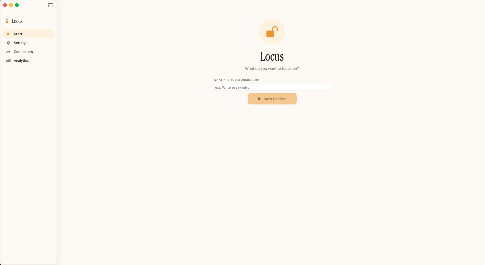
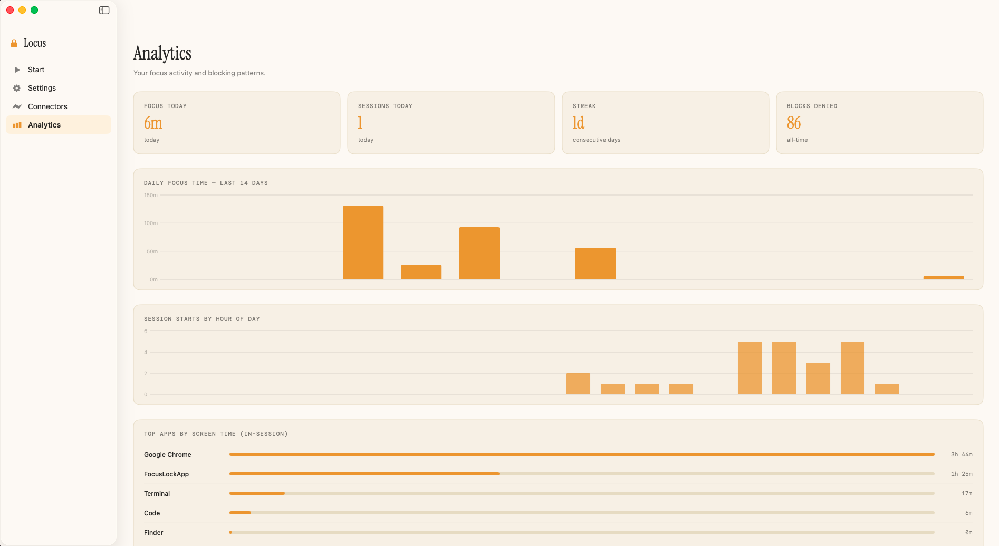
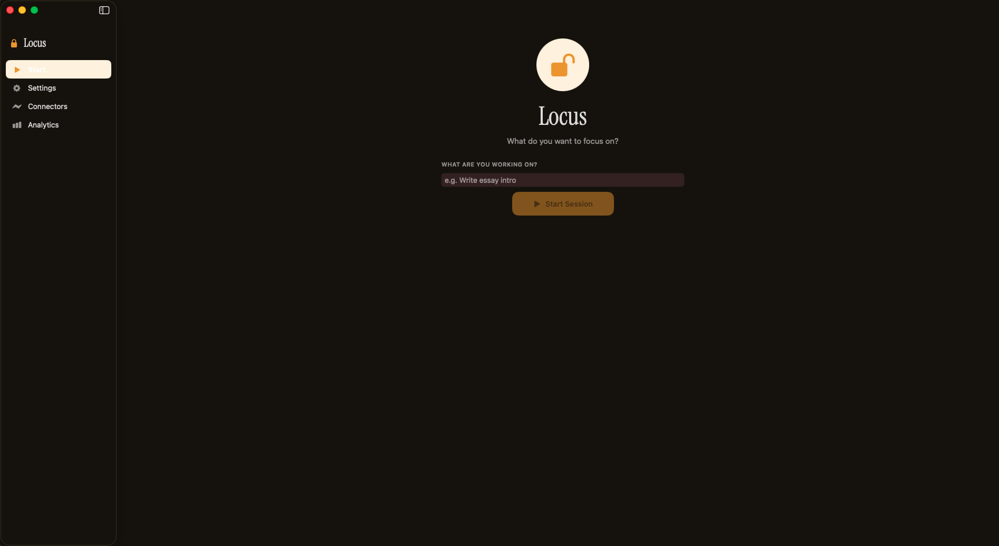
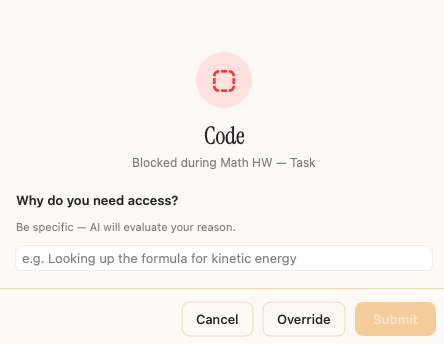

# Locus
Locus is a MacOS app that keeps you focused on whatever you are working on. You start by typing what you are working on, like "Math HW" or selecting something from a calender you connected. Then you visit a website/app. If the AI thinks that you are on task (like visiting math.com or something idk while in Math HW session), nothing happens. However if you visit something like fungames.com when in your focus session, it asks you why you need to visit the website. You can explain why, and if the AI finds it plausible, you're good! Otherwise, it'll block it and prevent you from visit the website.

I made it because I was using other blockers, and I thought that this was a really good idea with a pretty simple implementation!

One thing: its not meant to be perfect. The idea is to make you think twice before visit that website and by forcing you to write out your reason it makes you wonder yourself "why am i trying to watch youtube?" and it also makes you pause and relax for a second.

## Install
```
git clone https://github.com/K-man1/locus.git
cd locus

./build_daemon.sh
(cd FocusLockApp && ./build.sh)
codesign --force --deep --sign - FocusLockApp/build/Locus.app
cp -R FocusLockApp/build/Locus.app /Applications/
open /Applications/Locus.app
```
- macOS 13 (Ventura) or later
- Python 3.10+
- Swift compiler

## Screeshots
- Main Dashboard: 
- Analytics View: 
- Dark Mode: 
- Blocking View: 
